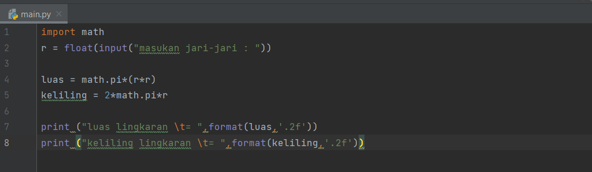
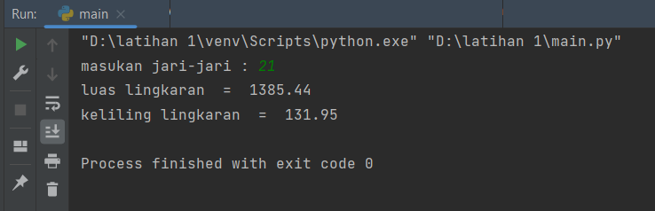
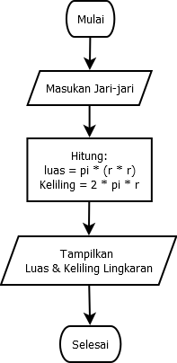

# tugas3 

# MENGHITUNG LUAS MENGHITUNG LUAS & KELILING LINGKARAN PADA PYTHON

# PROGRAM PYTHON MENGHITUNG LUAS & KELILING LINGKARAN

# Source Code
Berikut ini adalah Code Program untuk Menghitung Luas Lingkaran dan Keliling Lingkaran dalam bahasa pemrograman Python:
```
import math
r = float(imput("masukan jari- jari
luas = maath.pi*(r*r)
keliling = 2*math.pi*r
print ("luas lingkaran /t= ",forma
print ("keliling lingkaran /t= ",f
```


# Output (Hasil Running Program)

Berikut ini adalah hasil running program untuk menghitung luas Lingkaran dan Keliling Lingkaran dalam bahasa pemrograman Python.


# FLOWCHART MENGHITUNG LUAS & KELILING LINGKARAN


Penjelasan Algoritma Menghitung Luas dan Keliling Lingkaran sebagai berikut:

1.Mulai
2.Masukan Jari-Jari
3.Proses hitung Luas (L) dan Keliling (K) Lingkaran
4.Tampilkan Luas (L) dan Keliling (K) Lingkaran
5.Selesai
